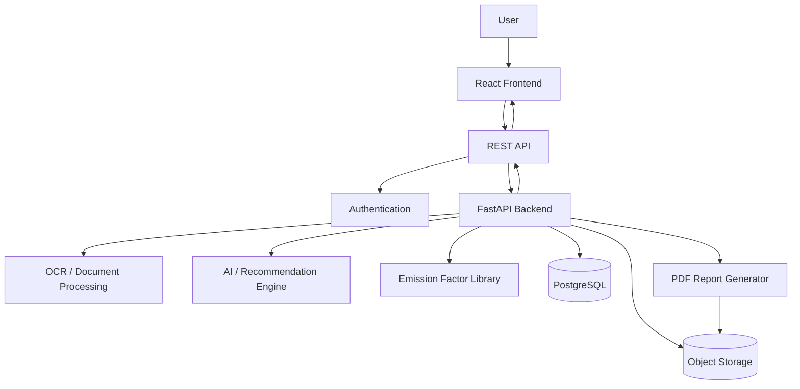
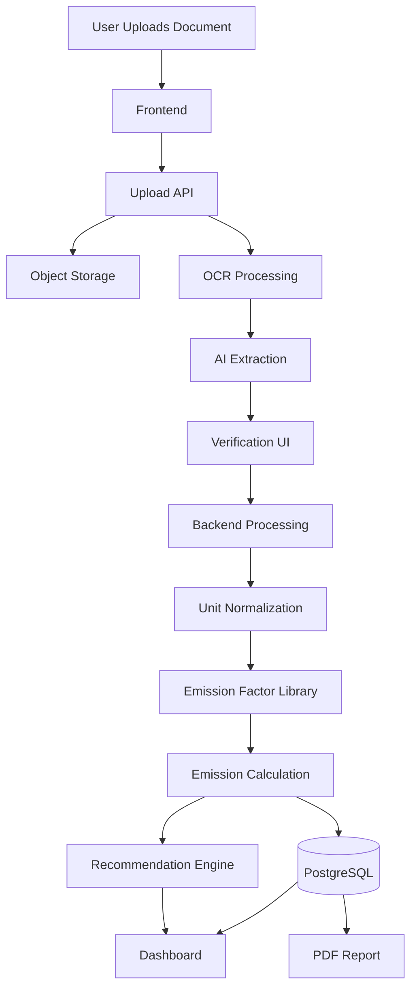

# Snap2Green

One upload. One verified footprint. One clearer path to climate action.

## 1. Project Title

# Snap2Green

## 2. One-Line Description

Snap2Green is an AI-powered, India-localized personal carbon accounting platform that turns everyday records such as electricity bills and fuel receipts into an effortless, traceable carbon footprint with personalized reduction recommendations.

## 3. Overview

Snap2Green is a modern web and mobile-ready carbon accounting application designed to remove the friction from personal carbon-footprint tracking.

Users can upload existing records such as:

- Electricity bills
- Fuel records/receipts
- Grocery receipts
- Travel tickets

AI/OCR extracts relevant activity data, the user verifies the extracted information, and the backend maps that activity to India-specific emission factors. Snap2Green then calculates the corresponding emissions and presents them through an understandable dashboard.

The target users are:

- Students and campus communities — primary pilot users
- Urban citizens — broader consumer audience
- Corporates — future users of the underlying engine for employee Scope 3 data

The application addresses the high effort required by existing carbon-tracking applications and the lack of an affordable, India-accurate, low-friction alternative.

Snap2Green solves this through:

1. Document-based activity capture
2. AI/OCR-assisted extraction
3. User verification
4. India-specific emission factors
5. Transparent emission calculations
6. Hotspot analytics
7. Personalized recommendations
8. Gamification
9. Downloadable carbon reports

The key innovation is changing the interaction model from continuous daily logging to occasional evidence-based uploads.

---

## 4. Problem Statement

Climate-conscious individuals increasingly want to understand and reduce their environmental impact, but existing personal carbon-footprint applications often depend on tedious manual logging.

Users may need to repeatedly enter:

- Travel information
- Fuel consumption
- Electricity usage
- Purchases
- Transportation activity
- Other daily activities

This creates a high-friction experience, causing users to abandon tracking after a short period.

There is a lack of a low-friction, India-accurate solution for citizens and students.

There is also a localization problem. International carbon applications may rely on generic emission factors rather than India-specific data.

Snap2Green therefore proposes using localized sources such as:

- CEA electricity-grid emission factors
- MoEFCC-related emission-factor values
- Indian fuel and transportation assumptions

The application also creates a potential bridge between personal carbon tracking and future corporate ESG requirements. Companies increasingly need better data around Scope 3 emissions, including employee-related activities.

### Why Existing Approaches Are Insufficient

| Problem                  | Existing Approach               | Snap2Green Approach                  |
| ------------------------ | ------------------------------- | ------------------------------------ |
| Daily manual logging     | User repeatedly enters activity | Upload existing records              |
| User effort              | High                            | Low                                  |
| Generic emission factors | Global/general assumptions      | India-localized factors              |
| Complex carbon data      | Technical numbers               | Visual insights                      |
| Static results           | Shows footprint                 | Adds recommendations                 |
| Low engagement           | Tracking becomes repetitive     | Gamification and comparison          |
| Poor traceability        | Factor source may be unclear    | Store factor/source with calculation |
| Consumer accessibility   | Enterprise-oriented tools       | Consumer-first pilot                 |

---

## 5. Our Solution

Snap2Green converts existing user records into structured carbon activity data.

The primary workflow is:

```text
User
  ↓
Upload Bill / Receipt / Ticket
  ↓
AI / OCR Extraction
  ↓
Extracted Activity Data
  ↓
User Verification
  ↓
Unit Normalization
  ↓
India-Specific Emission Factor
  ↓
Emission Calculation
  ↓
Audit Trail
  ↓
Carbon Dashboard
  ↓
Hotspots + Recommendations
  ↓
PDF Report / Actions
```

For example, an electricity bill may contain monthly consumption such as `1,200 kWh`.

Snap2Green can associate the activity with an applicable electricity emission factor and calculate:

```text
Emissions = Activity Data × Emission Factor

1,200 kWh × 0.716 kgCO₂/kWh
= 859 kgCO₂e
```

The application retains the emission factor and source used for every calculation so the result remains traceable.

### Core Product Principle

> Upload once instead of logging every day.

The system prioritizes accuracy, transparency, low user effort, and actionable insights.

---

## 6. Key Features

### MVP / Core Features

### 6.1 AI-Powered Document Upload

Allows users to upload supported records such as:

- Electricity bills
- Fuel records/receipts
- Grocery receipts
- Travel tickets

The user selects an activity type and uploads a document through the application.

---

### 6.2 OCR + AI Data Extraction

Extracts relevant information from uploaded documents.

Potential fields include:

- Document type
- Date
- Consumption
- Quantity
- Unit
- Fuel type
- Vendor/issuer
- Relevant activity information

The extracted information is displayed for verification before calculation.

---

### 6.3 User Verification

Displays extracted values in an editable verification screen.

The user can:

- Review extracted information
- Correct incorrect values
- Confirm the data

```text
Extracted Data
    ↓
Review
    ↓
Edit if necessary
    ↓
Confirm
```

---

### 6.4 India-Localized Emission Factors

Maps verified activities to appropriate emission factors.

The factor library stores:

```text
Factor
Source
Region
Unit
Effective Year
Category
```

---

### 6.5 Scope 1 Emission Calculation

Scope 1 represents direct emissions from supported activities such as:

- Vehicles
- Boilers
- Generators
- Fuel combustion

---

### 6.6 Scope 2 Emission Calculation

Scope 2 represents indirect emissions associated with purchased electricity.

Electricity consumption is normalized into kWh and multiplied by the applicable grid emission factor.

---

### 6.7 Transparent Calculation & Audit Trail

Every result maintains:

```text
Activity
→ Quantity
→ Unit
→ Normalized Quantity
→ Emission Factor
→ Factor Source
→ Calculation
→ Result
```

---

### 6.8 Carbon Dashboard

Displays:

- Total emissions
- Scope 1 emissions
- Scope 2 emissions
- Emissions over time
- Top emission sources
- Recent activities
- Recommended actions
- Progress indicators

---

### 6.9 Hotspot Analytics

Identifies the user's largest emission sources.

Example:

```text
Your Top Emission Sources

1. Electricity      62%
2. Fuel             24%
3. Other             9%
4. Travel             5%
```

---

### 6.10 Recommendation Engine

Generates prioritized recommendations based on actual emission hotspots.

Example:

```text
High electricity emissions detected.

Priority action:
Review high-consumption appliances and
consider reducing unnecessary electricity usage.
```

---

### 6.11 Automated PDF Report

Generates a downloadable report containing:

- Reporting period
- Total footprint
- Scope breakdown
- Activity breakdown
- Emission factors
- Calculation summary
- Hotspots
- Recommendations

---

### 6.12 Gamification

Can include:

- Personal progress
- Campus leaderboard
- Community comparison
- Milestones
- Micro-incentives

---

### Advanced / Future Features

- Automatic activity tracking
- Payment-based activity detection
- GPS-based activity detection
- Scope 3 tracking
- Employee commute tracking
- Corporate ESG dashboards
- Campus sustainability platform
- Organization-level analytics

Scope 3 remains outside the MVP.

---

## 7. User Journey


### Typical Flow

```text
Login
 ↓
Dashboard
 ↓
Add Activity
 ↓
Upload Electricity Bill
 ↓
AI extracts consumption
 ↓
User verifies information
 ↓
Snap2Green selects applicable factor
 ↓
Emission calculated
 ↓
Dashboard updated
 ↓
Hotspot identified
 ↓
Recommendation generated
 ↓
Report generated
```

---

## 8. Application Pages / Screens

### 8.1 Landing Page

**Purpose:** Introduce Snap2Green and explain the product.

**Important UI Components:**

- Hero section
- Product statement
- Upload workflow preview
- Carbon calculation visualization
- Feature highlights
- Primary CTA
- Impact section
- Footer

**User Actions:**

- Learn about Snap2Green
- Start the application
- View workflow

---

### 8.2 Authentication

**Purpose:** Secure user accounts.

**Components:**

- Login
- Registration
- Password reset
- Optional social authentication

**Data:**

- User identity
- Account metadata

---

### 8.3 Dashboard

**Purpose:** Central carbon overview.

**Components:**

- Total footprint card
- Scope 1 card
- Scope 2 card
- Trend chart
- Emission-source breakdown
- Recent activities
- Top hotspot
- Recommendation card
- Add Activity CTA

**Actions:**

- Add activity
- View activity
- Explore insights
- Generate report

---

### 8.4 Add Activity

**Purpose:** Start the data-capture workflow.

**Components:**

- Activity type selector
- Drag-and-drop upload
- Camera/upload option
- Supported document information
- Processing status

---

### 8.5 Verify Extracted Data

**Purpose:** Allow users to verify AI/OCR output.

**Components:**

- Original document preview
- Extracted fields
- Confidence indicators where available
- Editable fields
- Confirm button

**Actions:**

- Edit values
- Confirm
- Retry extraction

---

### 8.6 Calculation Details

**Purpose:** Show exactly how the footprint was calculated.

Example:

```text
Activity
Electricity

Consumption
1,200 kWh

Emission Factor
0.716 kgCO₂e/kWh

Calculation
1,200 × 0.716

Result
859 kgCO₂e
```

**Components:**

- Calculation breakdown
- Factor source
- Region
- Unit
- Audit information

---

### 8.7 Insights

**Purpose:** Help users understand their major emission sources.

**Components:**

- Emission-source chart
- Monthly trend
- Scope comparison
- Hotspot cards
- Recommendation cards

---

### 8.8 Reports

**Purpose:** Generate and access carbon reports.

**Components:**

- Reporting-period selector
- Report preview
- Download PDF
- Report history

---

### 8.9 Community / Leaderboard

**Purpose:** Provide habit-forming engagement.

**Components:**

- Campus leaderboard
- Personal ranking
- Progress
- Challenges
- Milestones

Community data should avoid exposing sensitive individual activity details.

---

## 9. System Architecture



### Frontend

Responsible for:

- User interface
- Authentication screens
- Upload experience
- Data verification
- Dashboard
- Charts
- Reports
- Loading and error states

### API Layer

Responsible for:

- Request validation
- Authentication
- Authorization
- Routing
- Error responses

### Backend

Responsible for:

- Business logic
- Activity processing
- Unit normalization
- Emission calculations
- Emission-factor matching
- Recommendations
- Report generation
- Database operations

### Database

Stores:

- Users
- Activities
- Extracted data
- Emission factors
- Calculations
- Recommendations
- Reports
- Gamification data

### Object Storage

Stores:

- Uploaded documents
- Generated reports

### AI/OCR

Responsible for:

- Document extraction
- Field extraction
- Recommendation generation

---

## 10. Technology Stack

### Frontend

| Technology      | Purpose            |
| --------------- | ------------------ |
| React           | Frontend framework |
| TypeScript      | Type safety        |
| Vite            | Build tooling      |
| Tailwind CSS    | Styling            |
| shadcn/ui       | UI components      |
| Recharts        | Data visualization |
| React Router    | Navigation         |
| React Hook Form | Forms              |
| Zod             | Validation         |

### Backend

| Technology          | Purpose          |
| ------------------- | ---------------- |
| Python              | Backend language |
| FastAPI             | REST API         |
| Pydantic            | Validation       |
| SQLAlchemy          | ORM              |
| JWT / Supabase Auth | Authentication   |
| ReportLab           | PDF generation   |

### Database

| Technology       | Purpose              |
| ---------------- | -------------------- |
| PostgreSQL       | Application database |
| Supabase         | Managed PostgreSQL   |
| Supabase Storage | File storage         |

### AI/ML

| Technology        | Purpose                                    |
| ----------------- | ------------------------------------------ |
| OCR engine        | Document text extraction                   |
| AI model          | Document understanding and recommendations |
| Python processing | Data normalization and inference           |

For a lightweight prototype, Tesseract can be used for OCR.

### Deployment

| Component | Recommended Platform      |
| --------- | ------------------------- |
| Frontend  | Vercel                    |
| Backend   | Render / Railway / Fly.io |
| Database  | Supabase                  |
| Storage   | Supabase Storage          |
| Domain    | Custom domain             |

### Dev Tools

- Git
- GitHub
- VS Code
- Cursor
- GitHub Copilot
- Claude Code
- Postman
- Pytest
- Vitest
- Playwright

---

## Assumptions

The PPT does not specify a mandatory implementation stack. This README therefore recommends React + TypeScript + FastAPI + PostgreSQL as a practical hackathon stack.

The MVP prioritizes electricity and fuel-related activity records because they are explicitly described in the proposed workflow and Scope 1/2 architecture.

Grocery receipts and travel tickets can be supported where reliable extraction and emission factors are available.

Scope 3 remains outside the MVP.

---

## 11. Folder Structure

```text
carbonlens/
│
├── frontend/
│   ├── public/
│   └── src/
│       ├── components/
│       │   ├── ui/
│       │   ├── charts/
│       │   ├── upload/
│       │   └── dashboard/
│       │
│       ├── pages/
│       │   ├── Landing.tsx
│       │   ├── Login.tsx
│       │   ├── Dashboard.tsx
│       │   ├── AddActivity.tsx
│       │   ├── VerifyActivity.tsx
│       │   ├── Insights.tsx
│       │   └── Reports.tsx
│       │
│       ├── hooks/
│       ├── services/
│       │   └── api.ts
│       ├── types/
│       ├── utils/
│       ├── App.tsx
│       └── main.tsx
│
├── backend/
│   ├── app/
│   │   ├── api/
│   │   │   ├── routes/
│   │   │   └── dependencies.py
│   │   │
│   │   ├── core/
│   │   │   ├── config.py
│   │   │   └── security.py
│   │   │
│   │   ├── models/
│   │   ├── schemas/
│   │   ├── services/
│   │   │   ├── activity_service.py
│   │   │   ├── emission_service.py
│   │   │   ├── recommendation_service.py
│   │   │   └── report_service.py
│   │   │
│   │   ├── ai/
│   │   │   ├── ocr.py
│   │   │   └── extraction.py
│   │   │
│   │   └── main.py
│   │
│   ├── tests/
│   ├── requirements.txt
│   └── Dockerfile
│
├── ml/
│   ├── preprocessing/
│   ├── models/
│   ├── inference/
│   └── README.md
│
├── database/
│   ├── migrations/
│   ├── seed/
│   └── schema.sql
│
├── docs/
│   ├── architecture.md
│   ├── emission-factors.md
│   └── api.md
│
├── tests/
│   ├── e2e/
│   └── integration/
│
├── .env.example
├── .gitignore
├── docker-compose.yml
└── README.md
```

### Important Directories

**`frontend/src/components/`**

Reusable UI components.

**`frontend/src/pages/`**

Application screens.

**`backend/app/services/`**

Core business logic.

**`backend/app/ai/`**

OCR and AI processing.

**`ml/`**

Optional ML models and inference code.

**`database/`**

Migrations and seed data.

**`docs/`**

Architecture and emission-factor documentation.

---

## 12. Backend API Design

### `POST /api/v1/activities/upload`

**Purpose:** Upload a supported carbon activity document.

**Authentication:** Required

**Request:**

```text
multipart/form-data

file: uploaded document
activity_type: electricity | fuel | grocery | travel
```

**Response:**

```json
{
  "activity_id": "uuid",
  "status": "processing"
}
```

---

### `GET /api/v1/activities/{activity_id}`

**Purpose:** Retrieve activity and extracted information.

**Authentication:** Required

**Response:**

```json
{
  "id": "uuid",
  "type": "electricity",
  "status": "verification_required",
  "extracted_data": {
    "consumption": 1200,
    "unit": "kWh",
    "date": "2026-09-01"
  }
}
```

---

### `PATCH /api/v1/activities/{activity_id}/verify`

**Purpose:** Confirm or correct extracted information.

**Authentication:** Required

**Request:**

```json
{
  "consumption": 1200,
  "unit": "kWh",
  "date": "2026-09-01"
}
```

**Response:**

```json
{
  "activity_id": "uuid",
  "status": "verified"
}
```

---

### `POST /api/v1/activities/{activity_id}/calculate`

**Purpose:** Calculate emissions from verified activity data.

**Authentication:** Required

**Response:**

```json
{
  "activity_id": "uuid",
  "scope": 2,
  "activity_value": 1200,
  "unit": "kWh",
  "emission_factor": 0.716,
  "factor_unit": "kgCO2e/kWh",
  "emissions": 859.2,
  "factor_source": "CEA"
}
```

---

### `GET /api/v1/dashboard`

**Purpose:** Retrieve dashboard-level footprint information.

**Authentication:** Required

**Response:**

```json
{
  "total_emissions": 859.2,
  "scope_1": 0,
  "scope_2": 859.2,
  "top_source": "electricity",
  "activity_count": 1
}
```

---

### `GET /api/v1/insights`

**Purpose:** Retrieve hotspot, trend, and recommendation data.

**Authentication:** Required

**Response:**

```json
{
  "hotspots": [],
  "monthly_trend": [],
  "recommendations": []
}
```

---

### `GET /api/v1/emission-factors`

**Purpose:** Retrieve available emission factors.

**Authentication:** Admin/service access where appropriate.

**Response:**

```json
{
  "factors": [
    {
      "category": "electricity",
      "region": "India",
      "value": 0.716,
      "unit": "kgCO2e/kWh",
      "source": "CEA"
    }
  ]
}
```

---

### `POST /api/v1/reports`

**Purpose:** Generate a carbon-footprint report.

**Authentication:** Required

**Request:**

```json
{
  "from": "2026-09-01",
  "to": "2026-09-30"
}
```

**Response:**

```json
{
  "report_id": "uuid",
  "status": "generated",
  "download_url": "..."
}
```

---

## 13. Database Design

### `users`

| Field      | Type      | Key    | Purpose          |
| ---------- | --------- | ------ | ---------------- |
| id         | UUID      | PK     | User identifier  |
| email      | VARCHAR   | UNIQUE | Login identity   |
| name       | VARCHAR   |        | Display name     |
| created_at | TIMESTAMP |        | Account creation |

---

### `activities`

| Field         | Type      | Key | Purpose               |
| ------------- | --------- | --- | --------------------- |
| id            | UUID      | PK  | Activity ID           |
| user_id       | UUID      | FK  | Activity owner        |
| activity_type | VARCHAR   |     | Electricity/fuel/etc. |
| source_file   | TEXT      |     | Storage reference     |
| status        | VARCHAR   |     | Processing state      |
| activity_date | DATE      |     | Activity date         |
| created_at    | TIMESTAMP |     | Upload timestamp      |

Relationship:

```text
users 1 ──────── N activities
```

---

### `activity_data`

| Field       | Type    | Key | Purpose           |
| ----------- | ------- | --- | ----------------- |
| id          | UUID    | PK  | Extracted-data ID |
| activity_id | UUID    | FK  | Related activity  |
| field_name  | VARCHAR |     | Field identifier  |
| value       | DECIMAL |     | Numeric value     |
| unit        | VARCHAR |     | Unit              |
| confidence  | DECIMAL |     | OCR confidence    |
| verified    | BOOLEAN |     | User verification |

---

### `emission_factors`

| Field          | Type    | Key | Purpose               |
| -------------- | ------- | --- | --------------------- |
| id             | UUID    | PK  | Factor ID             |
| category       | VARCHAR |     | Electricity/fuel/etc. |
| region         | VARCHAR |     | Geographic region     |
| value          | DECIMAL |     | Factor value          |
| unit           | VARCHAR |     | Factor unit           |
| source         | VARCHAR |     | Reference             |
| effective_year | INTEGER |     | Factor year           |

---

### `emission_calculations`

| Field            | Type      | Key | Purpose              |
| ---------------- | --------- | --- | -------------------- |
| id               | UUID      | PK  | Calculation ID       |
| activity_id      | UUID      | FK  | Related activity     |
| factor_id        | UUID      | FK  | Factor used          |
| scope            | INTEGER   |     | Scope 1 or 2         |
| normalized_value | DECIMAL   |     | Normalized activity  |
| emissions_kgco2e | DECIMAL   |     | Calculated emissions |
| calculated_at    | TIMESTAMP |     | Calculation time     |

Relationship:

```text
activities 1 ─── N emission_calculations
emission_factors 1 ─── N emission_calculations
```

---

### `recommendations`

| Field       | Type      | Key | Purpose              |
| ----------- | --------- | --- | -------------------- |
| id          | UUID      | PK  | Recommendation ID    |
| user_id     | UUID      | FK  | User                 |
| category    | VARCHAR   |     | Emission category    |
| title       | VARCHAR   |     | Recommendation title |
| description | TEXT      |     | Action description   |
| priority    | INTEGER   |     | Priority             |
| created_at  | TIMESTAMP |     | Creation time        |

---

### `reports`

| Field        | Type      | Key | Purpose       |
| ------------ | --------- | --- | ------------- |
| id           | UUID      | PK  | Report ID     |
| user_id      | UUID      | FK  | Report owner  |
| period_start | DATE      |     | Start date    |
| period_end   | DATE      |     | End date      |
| file_url     | TEXT      |     | PDF location  |
| created_at   | TIMESTAMP |     | Creation time |

---

### `leaderboard_entries`

| Field        | Type    | Key | Purpose            |
| ------------ | ------- | --- | ------------------ |
| id           | UUID    | PK  | Entry ID           |
| user_id      | UUID    | FK  | User               |
| community_id | UUID    | FK  | Campus/community   |
| score        | DECIMAL |     | Gamification score |
| period       | VARCHAR |     | Ranking period     |

Leaderboard implementation should use privacy-conscious aggregated metrics.

---

## 14. AI/ML Architecture


### Input

```text
Electricity Bill
Fuel Receipt
Grocery Receipt
Travel Ticket
```

### Preprocessing

The system may:

- Convert PDF pages to images
- Resize/crop documents
- Improve OCR readability
- Detect document type
- Normalize extracted text

### OCR

Extracts raw text and fields from uploaded documents.

### AI Extraction

Converts unstructured OCR output into structured activity data.

```json
{
  "activity_type": "electricity",
  "consumption": 1200,
  "unit": "kWh",
  "date": "2026-09-01"
}
```

### User Verification

The extracted information is displayed to the user before calculation.

### Emission Calculation

```text
Activity Data
      ×
Emission Factor
      =
kgCO₂e
```

### Recommendation Engine

Uses:

```text
User Activity
+
Emission Breakdown
+
Top Hotspots
+
Historical Trend
```

to generate prioritized recommendations.

AI should not modify or invent the underlying emission calculation.

### Model Location

AI/OCR processing runs through the backend.

Private API keys must never be exposed to the frontend.

---

## 15. Data Flow



### Example

```text
Electricity Bill
→ Upload
→ OCR
→ Extract 1,200 kWh
→ User verifies
→ Normalize kWh
→ Select applicable factor
→ Calculate emissions
→ Store calculation
→ Update dashboard
→ Identify hotspot
→ Generate recommendation
→ Generate report
```

---

## 16. Security

### Authentication

- Secure authentication
- Session/token management
- Password reset
- Protected application routes

### Authorization

Users must only access their own:

- Activities
- Documents
- Calculations
- Reports

### API Security

- HTTPS
- Authentication middleware
- Request validation
- Controlled CORS
- Rate limiting on expensive endpoints

### Environment Variables

Never commit:

- API keys
- Database passwords
- JWT secrets
- Service credentials

### File Validation

Validate:

- File type
- File size
- File extension
- Document compatibility

### Database Security

Use:

- Parameterized queries/ORM
- Access controls
- Minimal permissions
- Backups in production

### AI API Keys

AI provider credentials remain backend-only.

---

## 17. Error Handling

### Invalid Input

Display a clear validation message and allow correction.

### OCR Failure

Provide:

- Retry
- Clear error message
- Manual correction where appropriate

### AI Failure

Provide:

- Retry option
- Manual verification
- Processing status

No calculation should be generated from incomplete required data.

### Database Failure

Return controlled errors without exposing internal implementation details.

### Authentication Error

Redirect users to authentication when the session is invalid or expired.

### File Upload Error

Handle:

- Unsupported file
- Oversized file
- Corrupt document
- Failed upload
- Processing timeout

### Network Problems

Use:

- Retry actions
- Request timeouts
- Loading states
- Clear error messages

---

## 18. Modern UI/UX Requirements

Snap2Green should look like a modern climate-tech product rather than a generic CRUD dashboard.

### Design Principles

- Modern
- Clean
- Minimal
- Responsive
- Professional
- Accessible
- Data-focused
- Visually impressive

Avoid excessive environmental clichés and unnecessary visual clutter.

### Landing Page

Use:

- Strong headline
- Large product visualization
- Clear CTA
- Upload workflow preview
- Carbon calculation preview
- Feature highlights

Core visual story:

```text
Upload → Understand → Reduce
```

### Navigation

```text
Logo

Dashboard
Activities
Insights
Reports
Community

Profile
```

### Dashboard

Prioritize:

```text
Total Footprint
        ↓
Scope Breakdown
        ↓
Trend
        ↓
Hotspots
        ↓
Recommendations
```

### Charts

Use:

- Line chart → footprint trend
- Bar/donut chart → emission sources
- Scope comparison
- Progress indicators

### Upload Experience

Make uploading the central product interaction.

### Loading States

Use:

- Skeleton loaders
- Processing indicators
- Step-by-step progress

Example:

```text
✓ Document uploaded
✓ Reading document
● Extracting activity
○ Matching emission factor
○ Calculating footprint
```

### Empty States

Provide useful guidance instead of blank screens.

### Error States

Explain:

1. What happened
2. Why it happened when known
3. What the user can do next

### Animations

Use subtle:

- Page transitions
- Card interactions
- Chart animations
- Upload progress
- Number transitions

### Accessibility

Support:

- Keyboard navigation
- Visible focus states
- Semantic HTML
- Accessible labels
- Sufficient contrast
- Screen-reader-friendly controls

### Mobile Responsiveness

Support:

- Mobile
- Tablet
- Laptop
- Desktop

The upload and dashboard experience should remain usable on smaller screens.

---

## 19. AI / Innovation

### Normal Functionality

- Activity storage
- Unit normalization
- Emission-factor application
- Carbon calculations
- Analytics
- Report generation

### AI-Powered Functionality

- OCR-based document reading
- Intelligent field extraction
- Document understanding
- Personalized recommendation generation

### Innovative Component

#### Evidence-Based Carbon Tracking

Users start from records they already possess instead of manually entering every activity.

#### India-Localized Calculations

The architecture is designed around India-specific emission factors.

#### Explainable Carbon Numbers

Every result can be traced through:

```text
Activity
→ Quantity
→ Factor
→ Source
→ Calculation
→ Result
```

#### Action-Oriented Insights

The system identifies the user's biggest hotspots and recommends priority actions.

#### Consumer-to-Enterprise Path

The same tracking engine can eventually support corporate Scope 3 employee-footprint workflows.

---

## 20. Existing Solutions vs Our Solution

| Feature                  | Existing Solutions                 | Our Application                     |
| ------------------------ | ---------------------------------- | ----------------------------------- |
| Data entry               | Repeated manual logging            | Upload existing records             |
| User effort              | High                               | Low                                 |
| Electricity tracking     | Manual entry in many workflows     | OCR-assisted extraction             |
| Fuel tracking            | Manual/log-based                   | Receipt/record extraction           |
| India localization       | Often generic                      | India-specific factor architecture  |
| Calculation transparency | Varies                             | Factor + source + calculation trail |
| Hotspot analysis         | Available in some tools            | Core MVP                            |
| Recommendations          | Often generic                      | Based on user hotspots              |
| Reports                  | Varies                             | Core MVP PDF report                 |
| Gamification             | Not consistently central           | Planned engagement layer            |
| Consumer accessibility   | Often enterprise-oriented          | Consumer-first                      |
| Scope 1                  | Available in Snap2Green            | MVP                                 |
| Scope 2                  | Available in Snap2Green            | MVP                                 |
| Scope 3                  | Enterprise-focused in some systems | Future expansion                    |
| Corporate integration    | Enterprise-oriented                | Future B2B pathway                  |

---

## 21. Scalability

Snap2Green should begin as a modular monolith and evolve only when scale requires it.

### More Users

Use:

- Stateless APIs
- Connection pooling
- Caching
- Background document processing

### More Data

Use:

- PostgreSQL indexing
- Pagination
- Aggregation queries
- Database optimization

### More Organizations

Introduce:

```text
Organization
 ├── Members
 ├── Communities
 ├── Activities
 └── Reports
```

### Better AI Models

Keep AI behind service interfaces such as:

```python
extract_document(document)
```

This allows OCR/AI providers to be changed without rewriting the entire application.

### Cloud Scaling

Future architecture:

```text
Load Balancer
      ↓
API Instances
      ↓
Background Workers
      ↓
Database
      ↓
Object Storage
```

---

## 22. Deployment

### Production Architecture

```text
                         ┌──────────────┐
                         │   Users      │
                         └──────┬───────┘
                                │
                         HTTPS / Domain
                                │
                         ┌──────▼───────┐
                         │   Vercel     │
                         │   Frontend   │
                         └──────┬───────┘
                                │
                              REST
                                │
                         ┌──────▼───────┐
                         │   FastAPI    │
                         │   Backend    │
                         └──┬────┬───┬──┘
                            │    │   │
              ┌─────────────┘    │   └─────────────┐
              ▼                  ▼                 ▼
       PostgreSQL          Object Storage       AI/OCR
       /Supabase           /Supabase Storage     Service
```

### Frontend

Deploy React using Vercel.

### Backend

Deploy FastAPI using Render, Railway, Fly.io, or an equivalent container platform.

### Database

Use managed PostgreSQL through Supabase.

### Storage

Use object storage for uploaded documents and generated reports.

### AI/ML

Run AI/OCR processing server-side.

### Production Configuration

Use:

- HTTPS
- Environment variables
- Production logging
- CORS configuration
- Secure secrets

---

## 23. Local Development Setup

### 1. Clone Repository

```bash
git clone https://github.com/<your-username>/carbonlens.git
cd carbonlens
```

### 2. Install Frontend Dependencies

```bash
cd frontend
npm install
```

### 3. Install Backend Dependencies

```bash
cd ../backend
python -m venv .venv
```

Windows:

```bash
.venv\Scripts\activate
```

macOS/Linux:

```bash
source .venv/bin/activate
```

Install dependencies:

```bash
pip install -r requirements.txt
```

### 4. Configure Environment Variables

Create `.env` from `.env.example`.

### 5. Set Up Database

Configure PostgreSQL/Supabase and run:

```bash
alembic upgrade head
```

### 6. Start Backend

```bash
uvicorn app.main:app --reload
```

Backend:

```text
http://localhost:8000
```

### 7. Start Frontend

```bash
cd frontend
npm run dev
```

Frontend:

```text
http://localhost:5173
```

### 8. Test Application

Verify:

```text
Register
→ Login
→ Upload
→ OCR
→ Verify
→ Calculate
→ Dashboard
→ Insights
→ PDF Report
```

---

## 24. Environment Variables

Create `.env.example`:

```env
# Backend
DATABASE_URL=

# Authentication
JWT_SECRET=

# Storage
SUPABASE_URL=
SUPABASE_ANON_KEY=
SUPABASE_SERVICE_ROLE_KEY=

# AI / OCR
AI_API_KEY=
OCR_API_KEY=

# Frontend
VITE_API_URL=
```

Only variables required by the final implementation should be retained.

Never commit `.env`.

Service-role credentials and AI/OCR keys must remain server-side.

---

## 25. Testing

### Frontend

Test:

- Landing page
- Authentication
- Upload
- Verification
- Dashboard
- Charts
- Reports
- Responsive layouts

Recommended:

```text
Vitest
React Testing Library
Playwright
```

### Backend APIs

Test:

- Authentication
- Upload
- Activity retrieval
- Verification
- Calculation
- Dashboard
- Reports
- Authorization

Recommended:

```text
Pytest
HTTPX
```

### Database

Test:

- Relationships
- Constraints
- User isolation
- Emission factors
- Calculation persistence

### AI/OCR

Test:

- Clear electricity bills
- Low-quality images
- Different document layouts
- Missing fields
- Incorrect OCR values

### Calculation Engine

Unit-test deterministic calculations.

Example:

```text
1200 × 0.716 = 859.2 kgCO₂e
```

### Authentication

Test:

- Registration
- Login
- Invalid credentials
- Expired session
- Unauthorized access

### Main Workflow

```text
Authentication
→ Upload
→ OCR
→ Verification
→ Calculation
→ Dashboard
→ Recommendation
→ Report
```

---

## 26. Hackathon Demo Flow

The complete demo should take approximately 3–5 minutes.

### 1. Problem

Explain the friction of manual carbon tracking.

### 2. Enter Application

Open Snap2Green and show the landing page.

### 3. Upload Document

Upload a prepared electricity bill.

### 4. AI Extraction

Show the extracted activity data.

```text
Consumption: 1,200 kWh
Date: September 2026
Type: Electricity
```

### 5. Verification

Quickly confirm the extracted information.

### 6. Carbon Calculation

Show:

```text
1,200 kWh
×
0.716 kgCO₂e/kWh
=
859.2 kgCO₂e
```

Reveal the emission-factor source and calculation trail.

### 7. Dashboard

Show:

- Total footprint
- Scope 1
- Scope 2
- Trend
- Hotspots

### 8. AI Recommendation

Show the largest hotspot and the personalized recommendation.

### 9. Innovation

Present:

```text
One Upload
↓
AI Extraction
↓
India-Specific Factor
↓
Traceable Calculation
↓
Personalized Action
```

### 10. Impact

Finish with the campus pilot and future city/corporate expansion path.

---

## 27. Future Scope

Potential future improvements include:

1. Scope 3 activity tracking
2. Employee commute tracking
3. Corporate ESG dashboards
4. Campus-wide sustainability programs
5. Automatic activity detection
6. Payment integrations
7. GPS integrations
8. More Indian regional emission factors
9. Additional document types
10. Improved multilingual OCR
11. Better recommendation personalization
12. Organization-level analytics
13. Municipal partnerships
14. College sustainability-cell integrations
15. Corporate ESG-team integrations

---

## 28. Impact

### Users Helped

The initial pilot is designed around 100 students, with a longer-term path toward broader citizen adoption.

### Time Saved

The central value proposition is reducing repeated manual logging by allowing users to upload existing records.

```text
Traditional:
Daily logging → repeated effort

Snap2Green:
Occasional upload → automated extraction
```

### Cost Reduction

A consumer-first product can make carbon tracking more accessible than enterprise-oriented tooling.

### Efficiency

Automation reduces:

- Manual data entry
- Repeated calculations
- Report preparation
- Interpretation effort

### Accessibility

The product targets:

- Students
- Campus communities
- Urban citizens

### Environmental Impact

The intended outcome is measurable behavior change through:

- Awareness
- Hotspot identification
- Personalized recommendations
- Habit-forming engagement

Any percentage reduction should be measured after establishing a pilot baseline rather than claimed beforehand.

---

## 29. Project Roadmap

### Phase 1 — MVP

Build:

```text
Project Setup
→ Authentication
→ Database
→ Upload
→ OCR
→ Verification
→ Emission Factors
→ Calculation
→ Dashboard
```

Deliverables:

- React frontend
- FastAPI backend
- PostgreSQL
- Authentication
- Document upload
- OCR extraction
- Verification
- Scope 1/2 calculation
- Basic dashboard

---

### Phase 2 — Hackathon Demo

Add:

- Hotspot analytics
- Recommendation engine
- PDF reports
- Gamification
- Animations
- Demo data
- Responsive UI
- Loading/error states

---

### Phase 3 — Production

Add:

- Stronger authentication
- Improved OCR
- Background processing
- Monitoring
- Logging
- Backups
- Emission-factor management
- Extended testing
- Production infrastructure

---

### Phase 4 — Scale

Add:

- Campus organizations
- City-level deployment
- Corporate accounts
- Scope 3
- Employee footprint
- ESG integrations
- Enterprise reporting

---

## 30. Team Contribution

| Area                   | Responsibility                                                |
| ---------------------- | ------------------------------------------------------------- |
| Frontend               | Landing page, dashboard, upload flow, verification UI, charts |
| Backend                | FastAPI, APIs, business logic, authentication                 |
| AI/ML                  | OCR, document extraction, recommendation logic                |
| Database               | Schema, migrations, emission-factor data                      |
| UI/UX                  | Design system, responsive layouts, interactions               |
| Deployment/Integration | Frontend/backend/AI/database integration                      |
| Documentation          | README, architecture, demo narrative                          |

The project team roles described in the presentation include AIML, backend development, frontend development, and documentation responsibilities.

---

## 31. License

The MIT License is recommended for an open-source version of Snap2Green.

Create a `LICENSE` file containing the standard MIT License text and update the copyright holder/team information before publishing.

Third-party datasets, model weights, APIs, and assets must retain their respective licenses.

---

## 32. Final Project Summary

Snap2Green transforms carbon tracking from a repetitive data-entry task into an evidence-based, AI-assisted experience.

Instead of asking users to manually log every activity, the application starts with records they already have. AI/OCR extracts useful information, users verify it, and the backend applies India-specific emission factors to produce a transparent and traceable footprint.

The product combines:

```text
AI Extraction
+
India-Localized Factors
+
Deterministic Carbon Accounting
+
Hotspot Analytics
+
Personalized Recommendations
+
Gamification
+
Automated Reporting
```

The MVP focuses on Scope 1 and Scope 2, while Scope 3 and corporate applications remain future expansion areas.

The architecture is modular so the same foundation can evolve from a campus pilot into a broader citizen platform and eventually a corporate Scope 3 data layer.

> One upload instead of daily logging.
> One verified footprint instead of an unexplained number.
> One actionable recommendation instead of a static dashboard.

---

# AI DEVELOPMENT INSTRUCTIONS

The project should be implemented incrementally. Each layer should be functional before the next layer is added.

## 1. Project Setup

Create the repository structure and configure:

- React + TypeScript frontend
- FastAPI backend
- PostgreSQL
- Git/GitHub
- Environment variables

**Complete before moving forward:** frontend and backend can run independently.

---

## 2. Design System

Build:

- Typography
- Spacing
- Buttons
- Cards
- Inputs
- Modals
- Navigation
- Charts
- Toasts
- Loading states
- Error states

Create reusable components before building individual pages.

**Complete before moving forward:** landing page and dashboard shell use the same design system.

---

## 3. Authentication

Implement:

- Registration
- Login
- Logout
- Protected routes
- User sessions

**Complete before moving forward:** an authenticated user can securely access the dashboard.

---

## 4. Database

Create:

- Users
- Activities
- Activity data
- Emission factors
- Calculations
- Recommendations
- Reports

Add migrations and seed verified emission factors.

**Complete before moving forward:** backend can create and retrieve authenticated user activity data.

---

## 5. Backend APIs

Implement:

```text
/api/v1/activities
/api/v1/dashboard
/api/v1/emission-factors
/api/v1/insights
/api/v1/reports
```

Add:

- Validation
- Authentication
- Authorization
- Error handling

**Complete before moving forward:** APIs can be tested independently.

---

## 6. Core Feature

Implement:

```text
Upload
→ Extract
→ Verify
→ Normalize
→ Calculate
→ Store
```

Start with electricity bills.

**Complete before moving forward:** a verified electricity bill produces a persisted carbon result.

---

## 7. AI/ML Integration

Integrate:

- OCR
- Structured extraction
- Document understanding
- Recommendation generation

Keep AI isolated behind service interfaces.

The AI layer should assist with extraction and interpretation, while final emission calculations remain deterministic.

**Complete before moving forward:** uploaded documents can produce structured data suitable for verification.

---

## 8. Dashboard

Implement:

- Total footprint
- Scope 1/2
- Trends
- Hotspots
- Recent activities
- Recommendations

**Complete before moving forward:** dashboard updates after successful calculations.

---

## 9. Reports

Implement:

- Report generation
- Carbon summary
- Scope breakdown
- Activity breakdown
- Factor/source information
- Recommendations
- PDF download

**Complete before moving forward:** reports can be generated entirely from stored application data.

---

## 10. Testing

Test:

```text
Authentication
→ Upload
→ OCR
→ Verification
→ Calculation
→ Dashboard
→ Recommendations
→ Report
```

Add unit tests for the calculation engine and API tests for critical endpoints.

**Complete before moving forward:** the complete demo workflow works reliably with prepared sample documents.

---

## 11. Deployment

Deploy:

```text
Frontend → Vercel
Backend → Render/Railway/Fly.io
Database → Supabase PostgreSQL
Storage → Supabase Storage
AI/OCR → Backend-controlled service
```

Configure production environment variables and HTTPS.

**Final requirement:** the deployed application must reproduce the complete hackathon demo flow reliably without exposing API keys or database credentials.
